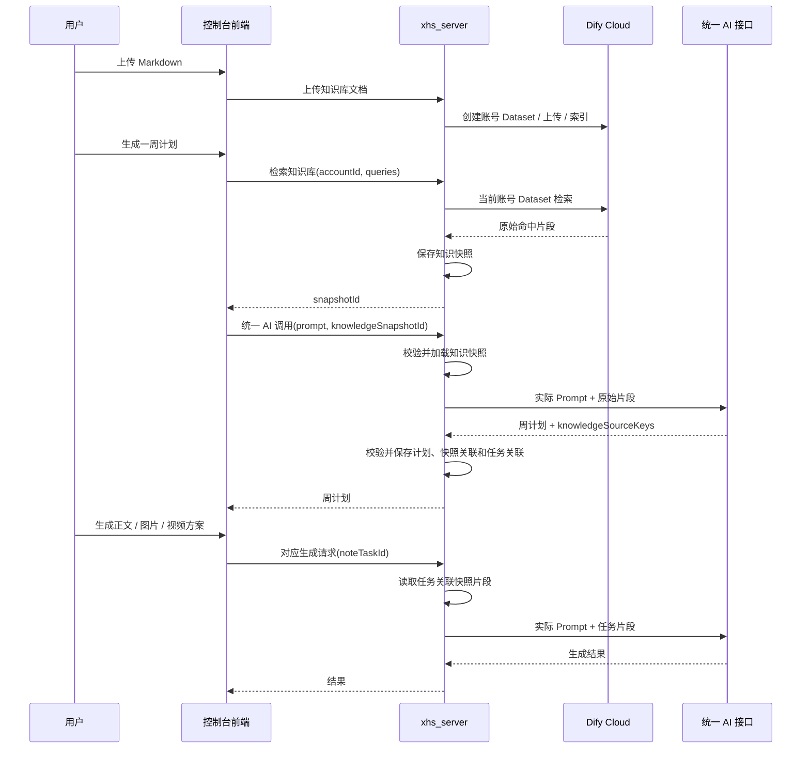

# Dify Cloud 账号知识库开发方案

## 1. 目标

用户为小红书账号上传 Markdown 资料，例如菜品、食材、供应链、房型、服务、路线和产品规格。系统在生成一周计划前检索当前账号的相关业务事实；后续三版正文、图片方案和视频方案复用该周计划绑定的事实快照，不重复检索。

知识库不放在 OpenClaw。OpenClaw 只接收已经生成的标题、正文和媒体任务。

## 2. 关键决策

1. 每个小红书账号对应一个独立 Dify Cloud Dataset。
2. Dify API Key 仅由 `xhs_server` 保存和调用。
3. Dify 返回原始片段、文档名、标题路径和相似度，不使用 Dify LLM 总结资料。
4. 客户端决定本次检索 query，但不接收原始片段；服务端保存检索快照，只返回 `snapshotId`。
5. 统一 AI 调用接口新增可选 `knowledgeSnapshotId`。接口按 ID 在服务端加载片段并追加到实际 Prompt，随后才调用 AI。
6. 周计划 AI 从快照片段中为每篇任务选择相关片段编号；后续生成只读取当前任务所选片段。
7. 爆款研究负责文风，账号策划负责定位，专家规则负责优化约束，知识库只提供业务事实和边界。

## 3. 整体流程



## 4. 客户端改造

### 4.1 知识库页面

新增与“爆款研究”同级的“知识库”页面，支持：

- 上传 UTF-8 `.md` 文件；
- 填写文档名称和说明；
- 查看当前账号文档名称、说明、字符数、索引状态和更新时间；
- 删除与替换文档；
- 查看索引失败原因。

不在周计划、笔记草稿、图片方案或视频方案页面展示每次使用的知识片段。

### 4.2 运营目标检索配置

在 `src/lib/weeklyPlanningObjectives.ts` 的每个运营目标中新增：

```ts
type WeeklyPlanningObjective = {
  id: string;
  name: string;
  help: string;
  theme: string;
  goal: string;
  planningRules: string[];
  knowledgeRetrievalQuery: string;
};
```

`knowledgeRetrievalQuery` 是短检索意图，不是完整说明句或生成 Prompt。例如：

| 餐饮运营目标 | `knowledgeRetrievalQuery` |
| --- | --- |
| 单菜品爆款 | 主推菜品；食材、风味、口感、分量、制作特点、用餐场景 |
| 活动转化 | 套餐、活动规则、适用条件、预约方式、时间限制、不可承诺事项 |
| 当地特色 | 本地食材、地域风味、地点、体验、可确认特色 |
| 到店体验 | 门店空间、服务、到店场景、真实体验细节 |

所有账号类目的所有运营目标都必须补齐该字段。

### 4.3 周计划前的检索请求

客户端根据用户输入构造 `queries`：

1. `weeklyFocus` 非空：只发起一个 query：

```text
{weeklyFocus}；业务事实、特点、可表达细节、不可虚构边界
```

2. `weeklyFocus` 为空：将每个已选运营目标的 `knowledgeRetrievalQuery` 作为一条 query。
3. 两者都没有：跳过检索，直接按当前方式生成周计划。

客户端调用知识检索接口后，仅获得 `snapshotId`，再将它作为统一 AI 调用的可选参数。客户端不接收、不缓存、不拼接原始知识片段。

## 5. 服务端数据与接口

### 5.1 数据

| 数据 | 必要字段 |
| --- | --- |
| `account_knowledge_bases` | `account_id`、`dify_dataset_id`、`status`、`last_error` |
| `account_knowledge_documents` | `account_id`、`dify_document_id`、`title`、`description`、`content_sha256`、`content_chars`、`status`、`error_message` |
| `knowledge_retrieval_snapshots` | `id`、`account_id`、`references_json`、`created_by`、`created_at`、`expires_at`、`status` |
| `weekly_plan` | `knowledge_snapshot_id` nullable |
| `note_task` | `knowledge_source_keys` JSON nullable |

`references_json` 保存本次最终保留的原始 Dify 片段：`K1-Kn`、文档 ID、文档名、标题路径、片段 ID、相似度和正文。快照不能跨账号使用。

未被周计划保存流程关联的临时快照，可在 24 小时后清理。

### 5.2 知识库文档接口

| 方法 | 路径 | 作用 |
| --- | --- | --- |
| `POST` | `/client/accounts/{accountId}/knowledge-documents` | 上传 `.md` 至当前账号 Dataset |
| `GET` | `/client/accounts/{accountId}/knowledge-documents` | 获取文档和索引状态 |
| `PUT` | `/client/accounts/{accountId}/knowledge-documents/{id}` | 更新名称/说明或替换文件 |
| `DELETE` | `/client/accounts/{accountId}/knowledge-documents/{id}` | 删除 Dify 文档和本地记录 |

上传规则：仅 UTF-8 `.md`；建议单文件最大 2 MB、单账号最多 50 份；拒绝空文件、无效编码与重复内容。

### 5.3 检索接口

```http
POST /client/accounts/{accountId}/knowledge-retrievals
```

请求：

```json
{
  "queries": [
    "主推菜品；食材、风味、口感、分量、制作特点、用餐场景",
    "门店空间、服务、到店场景、真实体验细节"
  ]
}
```

响应不含片段全文：

```json
{
  "snapshotId": "kr_01H...",
  "status": "ready",
  "hasReferences": true
}
```

服务端行为：校验账号权限；根据 `accountId` 找到唯一 Dataset；调用 Dify `POST /v1/datasets/{dataset_id}/retrieve`；合并结果并保存快照。

### 5.4 统一 AI 调用接口扩展

统一 AI 调用接口新增可选字段：

```json
{
  "input": "现有 Prompt 内容",
  "knowledgeSnapshotId": "kr_01H..."
}
```

当 `knowledgeSnapshotId` 存在时，服务端必须：

1. 校验快照存在、属于当前用户可访问账号、状态有效；
2. 读取快照原始片段；
3. 以“仅供事实参考”的固定格式追加到实际发送给 AI 的 Prompt；
4. 不把原始片段返回浏览器，也不信任客户端传来的资料正文。

统一 AI 接口不需要理解“周计划”“正文”或“图片方案”等业务类型；业务行为继续由 Prompt 决定。

## 6. Dify 检索与快照规则

使用 Dify `semantic_search`。query 是聚焦短语，不传账号名称、账号类型、用户画像、完整策划案、爆款文风或历史主题，因为账号已由独立 Dataset 隔离。

| 场景 | Dify 调用 |
| --- | --- |
| 有 `weeklyFocus` | 一次查询，`top_k=8` |
| 无重点、有多个运营目标 | 每个目标各一次查询，单次 `top_k=3` |
| 无重点、无运营目标 | 不调用 Dify |

初始相似度阈值为 `0.45`。服务端合并结果后：

- 按相似度排序；
- 去重、过滤低分和高度重复片段；
- 总文本不超过 4,500 个中文字符或等价 token；
- 不固定片段数量；
- 设置 12 段异常保护上限，防止大量极短片段绕过字符预算；
- 依次编号为 `K1-Kn`。

## 7. 周计划与任务关联

生成周计划时，统一 AI 接口在服务端追加全部快照片段。周计划 Prompt 额外要求每篇任务返回：

```json
{
  "topicTitle": "安吉战斧牛排实测",
  "contentGoal": "分享肉质、火候和入口体验",
  "coreView": "把可核验的风味与口感细节写成自然的聚餐分享",
  "knowledgeSourceKeys": ["K2", "K5"]
}
```

服务端在保存周计划时：

1. 校验 `knowledgeSourceKeys` 仅来自当前 `knowledgeSnapshotId` 的 `K1-Kn`；
2. 无效编号拒绝保存并要求重新生成或返回错误；
3. 保存 `weekly_plan.knowledge_snapshot_id`；
4. 保存每篇 `note_task.knowledge_source_keys`。

`knowledgeSourceKeys` 是内部字段，不向客户端展示。周计划 AI 在生成时能看到全部快照片段；该字段用于让后续每篇内容只继承与自身主题相关的业务事实。某篇任务确实需要全部片段时，允许选择全部编号。

## 8. 后续生成流程

三版标题正文、图片方案和视频方案均不调用 Dify。

服务端根据 `noteTaskId` 找到所属周计划的 `knowledge_snapshot_id`，再按 `knowledge_source_keys` 读取片段并追加到实际 Prompt。

| 流程 | 最大知识上下文 | 异常保护 |
| --- | ---: | ---: |
| 三版标题正文 | 3,000 中文字符 | 最多 8 段 |
| 图片方案 | 2,500 中文字符 | 最多 8 段 |
| 视频方案 | 2,500 中文字符 | 最多 8 段 |

只注入完整片段，不在片段中间截断。若某任务选择的片段整体无法满足后续预算，应在周计划生成时选择更少的 `knowledgeSourceKeys`，不能静默丢失事实。

知识库只影响事实内容和边界；爆款文风仍决定表达方式，运营目标规则和专家规则仍优先于知识库。

## 9. 降级、安全与验收

### 9.1 降级

| 场景 | 处理 |
| --- | --- |
| 未上传资料、无 Dataset、无 ready 文档 | 跳过检索，按现有流程生成 |
| Dify 超时或 5xx | 记录 warning，按无知识库流程生成，不阻断用户 |
| 无相关命中 | 创建空快照或跳过快照，按现有流程生成 |
| 快照无效或跨账号 | 拒绝使用，不访问其他 Dataset |

### 9.2 安全

- 所有文档、检索和快照操作均校验账号权限；
- Dify API Key、原始片段和完整 Prompt 不记录到常规日志；
- 知识库内容作为不可信输入，不执行其中指令；
- 使用 Dify Cloud 前确认其对供应链、配方与经营资料的数据处理策略可接受。

### 9.3 验收

1. 不同账号拥有独立 Dataset，不能交叉检索。
2. 用户可上传、索引、替换和删除 Markdown 文档。
3. 前端检索接口只返回 `snapshotId`，不返回原始片段。
4. 统一 AI 接口按 `knowledgeSnapshotId` 在服务端追加资料。
5. 周计划为每篇任务保存有效的 `knowledgeSourceKeys`。
6. 正文、图片和视频生成不调用 Dify，只使用任务快照。
7. Dify 不可用或没有命中时，现有生成流程仍可运行。
